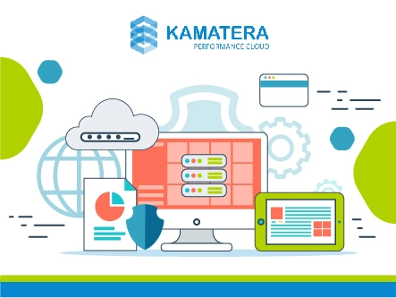
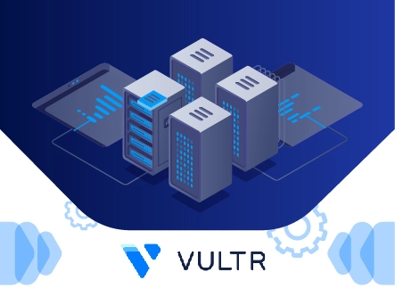

# 2025年，9家值得关注的NVMe VPS主机服务商

---

技术已经成为企业发展的第二只手。无论你运营什么类型的网站，选对主机服务就像找到了合适的基础设施——它决定了你的网站能跑多快、能承载多少访问者。

如果你正在寻找兼顾速度和隐私的主机方案，NVMe VPS主机可能是最适合你的选择。但市面上提供NVMe VPS的服务商那么多，怎么找到真正靠谱的那一个？

别担心，接下来我会带你看看当下最受欢迎的几家NVMe VPS主机提供商，看看它们各自的特点和优势。

---

## 什么是NVMe VPS主机?

NVMe VPS主机，全称Non-Volatile Memory Express，说白了就是在物理服务器上运行的虚拟专用服务器。

它最大的特点就是快——比传统SSD快得多。通过使用更先进的存储架构，NVMe能大幅缩短网站加载时间，给用户更流畅的访问体验。

在这个什么都讲究速度的时代，选择合适的NVMe VPS主机平台，能让你的网站在性能上抢占先机。下面我就来逐一介绍这9家值得考虑的服务商。

**快速导航：**

1. YouStable - 综合表现最佳的NVMe VPS主机
2. Kamatera - 灵活的NVMe VPS解决方案
3. ScalaHosting - 最佳NVMe SSD VPS提供商
4. InterServer - 价格亲民的NVMe VPS
5. UltaHost - 快速且安全的NVMe VPS服务
6. Hosting.com - 速度提升20倍的NVMe VPS
7. Contabo - 可靠且快速的NVMe VPS方案
8. Vultr - 灵活且价格合理的NVMe VPS主机
9. Cloudways - 最佳托管式NVMe VPS解决方案

## 1. YouStable - 综合表现最佳的NVMe VPS主机

YouStable从2015年开始运营，最初是印度本土的主机服务商。但现在它已经在多个国家站稳了脚跟。

公司总部位于勒克瑙，现在在全球拥有多个数据中心。最吸引人的是它的价格——高级主机方案起价仅12.50美元，性价比相当高。

YouStable提供的服务种类很丰富：NVMe主机、WooCommerce主机、博客主机、Magento主机、Joomla主机、Linux主机、WordPress主机、论坛主机等等。

**核心特点：**

🔶 **NVMe SSD驱动的服务器**：所有主机方案都配备NVMe SSD，速度有保障。

🔶 **每日自动备份**：YouStable会每天自动备份你的网站数据，把资料存在安全的地方。

🔶 **易用的控制面板**：YouStable的控制面板设计得很友好，新手也能轻松上手。

🔶 **免费网站迁移**：如果你想从其他主机商迁移过来，他们会免费帮你搞定所有文件转移。

🔔 **2025年优惠**：YouStable目前提供15%折扣，现在购买VPS服务器能省不少钱。

## 2. Kamatera - 灵活的NVMe VPS解决方案

Kamatera成立于1995年，是一家全球云服务平台。它不只是提供单一的云服务，而是给客户提供了一整套定制化的云计算技术方案。

现在Kamatera在全球运营着多个数据中心，拥有大量服务器。从初创公司到开发者，再到国际化企业，Kamatera都能提供适合的服务。

除了基础的云服务器，Kamatera还提供云防火墙、全托管云、云块存储、私有云网络、云负载均衡器等多种产品。

**核心特点：**

🔶 **每日备份**：如果出了什么问题需要恢复数据，Kamatera每天都会自动备份你的服务器，保护你的重要数据不丢失。

🔶 **多个数据中心**：Kamatera在全球拥有多个数据中心，能让目标用户快速访问你的网站。

🔶 **免费试用**：新客户可以获得30天免费试用，包含一个云VPS实例和100美元的服务积分。

🔶 **无需硬件维护**：因为是云架构，你不用担心硬件维护的问题。

🔔 **2025年优惠**：现在就开始Kamatera的30天免费试用吧！无隐藏费用，24/7全天候支持。

## 3. ScalaHosting - 最佳NVMe SSD VPS提供商

ScalaHosting是最佳的NVMe SSD VPS提供商之一，提供无限带宽，让你的网站性能达到最优。

除了NVMe SSD，ScalaHosting在服务器中使用的其他硬件也很强大，比如最新的Intel Xeon E5系列处理器。这是市面上最好最快的处理器之一，专门为多线程处理设计。

**核心特点：**

🔶 **无限带宽**：ScalaHosting提供无限带宽，让你能够不受限制地使用分配的资源，享受不间断的网络性能。

🔶 **每日异地备份**：异地备份意味着ScalaHosting创建了单独的服务器来存储你的网站备份，为你的网站提供坚不可摧的安全保障。

🔶 **免费一键应用安装器**：ScalaHosting还提供易用的一键应用安装器，你可以轻松安装所有喜欢的应用。

🔶 **实时恶意软件防护**：ScalaHosting提供实时恶意软件防护功能，持续扫描你的资源并立即修复漏洞。

🔔 **2025年优惠**：ScalaHosting限时优惠最高36%折扣，使用优惠码GOOGIEHOST还能再获得10%折扣。

## 4. InterServer - 价格亲民的NVMe VPS提供商

InterServer成立于1999年，是主机行业的老牌企业之一。公司一直致力于提供多种主机服务，包括共享主机、专用服务器、快速服务器和云主机，这些服务在同类中都是顶级的。

公司的终极愿景是为客户提供一站式解决方案，并按时满足他们的期望。InterServer已经扩展了业务范围，覆盖国内和国际客户。

**核心特点：**

🔶 **无限存储空间**：InterServer提供无限磁盘空间，如果你在计划范围内需要更多空间，可以享受不间断的主机服务。

🔶 **99.9%正常运行时间保证**：InterServer知道即使是很小的停机时间也可能让你损失许多潜在客户，所以他们提供99.9%的正常运行时间保证。

🔶 **完全Root访问权限**：安装、定制和运行任何你想要的软件。InterServer根据你的便利性来实现主机计划。

🔶 **速度优化**：InterServer支持最佳的网站速度，页面加载时间短。你可以在几秒钟内获得VPS解决方案。

🔔 **2025年优惠**：InterServer目前提供3个月1美元的优惠，使用优惠码GRABPENNY即可享受。

## 5. UltaHost - 快速且安全的NVMe VPS服务

UltaHost是最好的NVMe VPS主机服务之一，提供最佳的内置可靠存储技术，保证更快的网站加载速度。

UltaHost还提供对VPS服务器的完全Root访问权限，让用户能够根据需求完全管理服务器。此外，UltaHost以通过实时聊天和工单系统提供全天候最佳支持服务而闻名。

**核心特点：**

🔶 **最新NVMe SSD存储技术**：UltaHost提供最新的NVME存储技术，提升网站加载速度。

🔶 **高级DDoS防护**：获得最高级别的DDoS防护、BitNinja安全和IP白名单，全天候保护数据，保护你的网站免受恶意网络威胁。

🔶 **完全Root访问权限**：UltaHost提供对VPS服务器的完全Root访问权限，让用户能够根据需求配置服务器。

🔶 **全托管VPS服务器**：UltaHost的VPS服务器是全托管的，让用户能够更专注于网站开发。

🔔 **2025年优惠**：限时优惠，购买UltaHost VPS最高可享30%折扣！使用优惠码GOOGIEHOST还能再获得7%折扣。

## 6. Hosting.com - 速度提升20倍的NVMe VPS提供商

Hosting.com自2001年以来一直是市场的领导者，如今以提供世界上最快的服务器而闻名。

到目前为止，该公司已将其产品交付到超过233个国家，并获得了业内最佳托管解决方案公司之一的称号。

在Hosting.com，你可以获得全年365天、每天24小时的客户服务。此外，数据中心位于亚利桑那州、密歇根州、阿姆斯特丹和新加坡，提供更快的速度和更好的连接性。

**核心特点：**

🔶 **免费cPanel**：通过Hosting.com，你的企业网站可以获得免费的cPanel账户。

🔶 **易于管理的服务器**：无论你是不是开发者，Hosting.com都为你设计了合适的VPS服务器。服务器简单、易懂且用户友好。

🔶 **支持服务**：通过实时聊天、电子邮件、工单和电话提供高效的客户支持。

🔶 **免费网站迁移**：可以免费将你的网站迁移到不同的计划。

🔔 **2025年优惠**：限时优惠，Hosting.com的VPS计划可节省50%。

## 7. Contabo - 可靠且快速的NVMe VPS解决方案

正在寻找先进的NVMe主机解决方案？Contabo适合你。从2003年仅有9个数据中心开始，该公司一直在努力吸引客户的注意。

现在他们在全球拥有多个数据中心。该公司也被称为Giga-International，专注于先进的虚拟专用服务器(VPS)、虚拟专用服务器(VDS)等。

**核心特点：**

🔶 **完全Root访问权限**：Contabo提供对你的虚拟专用服务器的完全Root访问权限，你可以使用选择的操作系统。因此，管理服务器非常灵活。

🔶 **自定义存储**：使用Contabo，你永远不必担心存储问题。它提供大量存储空间。此外，你可以使用扩展存储附加组件来获得更多空间。

🔶 **安全功能**：Contabo通过DNS管理、SSL认证等功能为你的服务器和数据提供高安全性。

🔔 **2025年优惠**：目前最佳的Contabo折扣码是主机10%折扣券。此促销码适用于VPS主机、SSD网站主机和专用服务器主机。

## 8. Vultr - 灵活且价格合理的NVMe VPS主机

对于需要全球化部署的项目来说，选择一个拥有广泛数据中心网络的主机服务商至关重要。👉 [想要在全球多个位置快速部署你的应用？Vultr提供32个数据中心位置供你选择](https://www.vultr.com/?ref=9738262-9J)，让你的服务更贴近目标用户，大幅降低延迟。

Vultr成立于2014年，目标是通过先进的云计算服务简化基础设施部署。

该公司在全球23个数据中心提供多样化的主机和其他服务。

**核心特点：**

🔶 **全球网络**：Vultr拥有广泛的网络基础，包括多个位置，提供高速度和连接性。

🔶 **自定义控制面板**：控制面板的设计考虑了客户及其问题。因此，许多功能可以通过一次点击安装。

🔔 **2025年优惠**：限时优惠，Vultr为新用户提供价值50美元的免费积分。

## 9. Cloudways - 最佳托管式NVMe VPS解决方案

Cloudways倡导创新方法和简单解决方案。该平台旨在通过领先的先进技术使云计算更易于使用。

Cloudways是通过其有效解决方案管理服务器问题的最佳主机提供商之一。

**核心特点：**

🔶 **速度和性能**：Cloudways提供令人印象深刻的速度和性能。通过在不同大陆的多个数据中心，你可以获得最高速度和有效质量。

🔶 **易于使用**：无论你是否是专家，Cloudways对每个人来说都很容易使用。

🔶 **一对一支持**：Cloudways认为每个客户都很有价值。因此，为了确保不间断的流程，他们提供24/7/365的个性化支持。

🔔 **2025年优惠**：限时优惠，Cloudways提供3天免费试用，无需信用卡。

## NVMe VPS主机的优势

**以下是使用NVMe VPS主机的优势：**

### 为你的网站提供高性能

NVMe通过使用不同于SATA磁盘的架构为你的网站提供高性能。

### 快速且节能

除了提供高性能外，它对你的网站来说也很节能。说到NVMe SSD，预计SSD比其他任何东西消耗更少的能源。

### 获得高级用户体验

通过更好的主机速度和性能，你的用户将有机会获得更好的整体用户体验。除此之外，你还可以在更短的时间内增加服务采购者和购买量。

---

## 结语

以上就是关于9家最佳NVMe VPS主机服务的介绍。它们都很出色，你选择哪一个很大程度上取决于你的具体需求和要求。

不过，如果你问我的话，我强烈推荐YouStable作为解决方案。它功能丰富，提供高速度和正常运行时间，最重要的是，价格非常实惠。

在全球化部署和高性能需求方面，Vultr也是一个值得考虑的选择。它在全球拥有众多数据中心，能够为你的业务提供灵活且可靠的基础设施支持。👉 [如果你的项目需要快速扩展和全球覆盖，Vultr的按需付费模式和丰富的配置选项会是理想的选择](https://www.vultr.com/?ref=9738262-9J)。

希望这篇文章对你有帮助，祝你找到最适合自己需求的NVMe主机解决方案！
